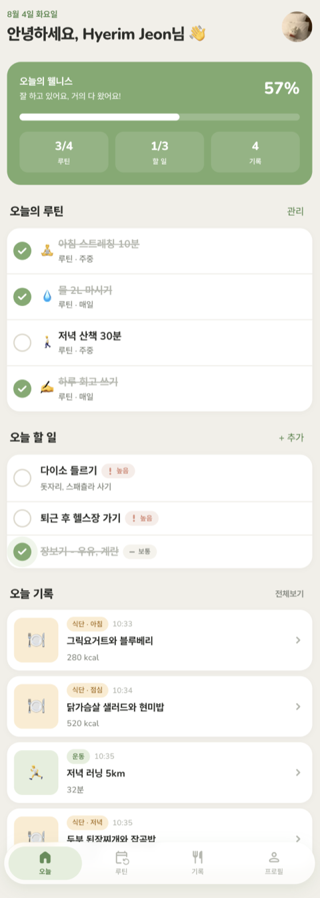
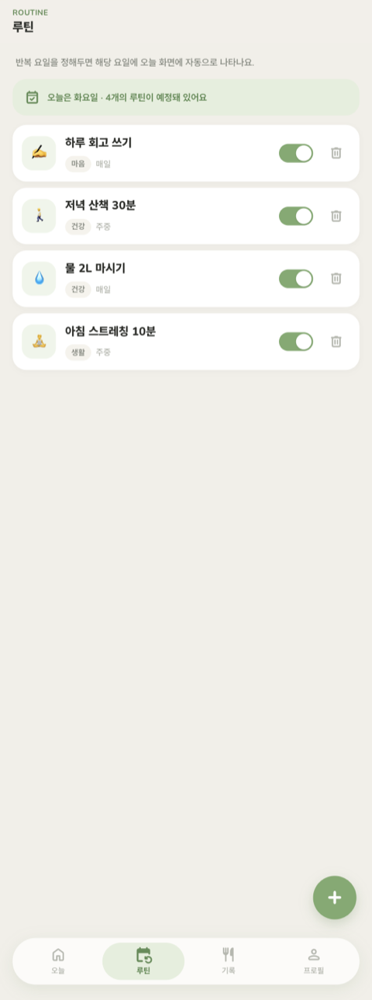
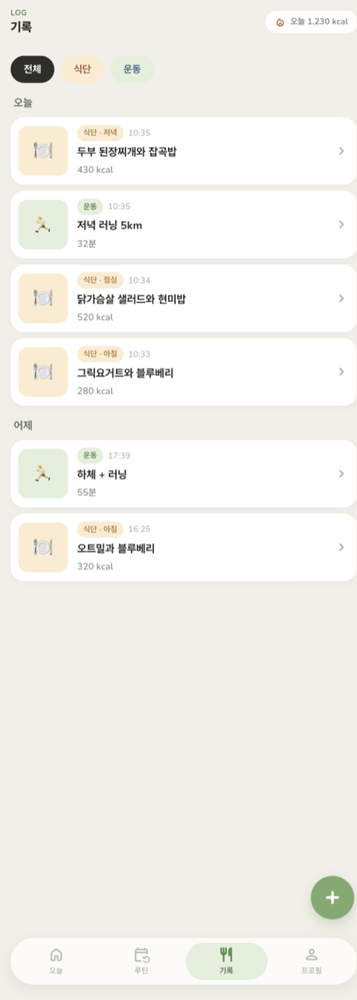
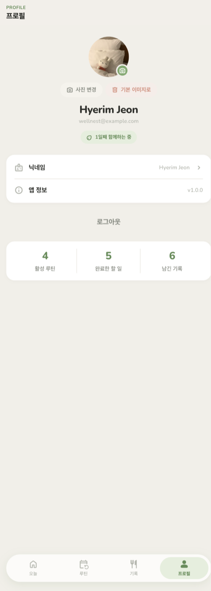
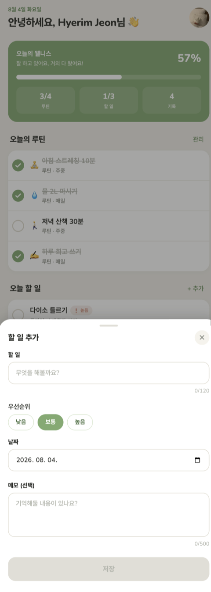
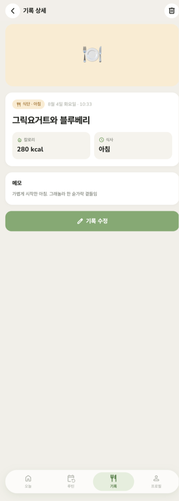
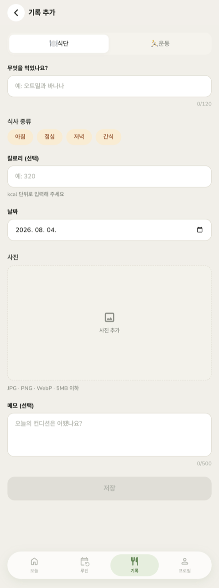

# 🌿 Wellnest

> 할 일과 루틴을 관리하면서 식단·운동 기록까지 한곳에 남기는 **웰니스 투두 웹앱**

투두 앱 · 식단 앱 · 운동 앱을 오가느라 기록이 끊기는 문제를 해결합니다.
오늘 할 일을 체크하는 그 화면에서 아침 식사와 저녁 운동을 함께 남길 수 있습니다.

**[▶ 서비스 바로가기](https://wellnest-gamma.vercel.app)**
· [기획 문서(PRD)](docs/PRD.md)
· [기능 스펙](docs/specs)
· [데이터 모델](docs/DATA-MODEL.md)
· [디자인 시스템](design/DESIGN-SYSTEM.md)

<sub>데모는 포트폴리오 시연용 인스턴스입니다. 데이터가 초기화되거나 접속이 중단될 수 있습니다.</sub>

<br />

<table>
  <tr>
    <td width="25%"></td>
    <td width="25%"></td>
    <td width="25%"></td>
    <td width="25%"></td>
  </tr>
  <tr>
    <td align="center"><sub><b>오늘</b> · 루틴 체크 + 할 일 + 기록 요약</sub></td>
    <td align="center"><sub><b>루틴</b> · 반복 요일 지정</sub></td>
    <td align="center"><sub><b>기록</b> · 식단·운동 통합 타임라인</sub></td>
    <td align="center"><sub><b>프로필</b> · 아바타 업로드·통계</sub></td>
  </tr>
</table>

---

## 왜 만들었나

건강 관리는 특별한 이벤트가 아니라 **매일 반복되는 작은 실천의 누적**입니다.
그런데 시장의 도구들은 이 실천을 세 갈래로 쪼개 놓았습니다.

| | 잘하는 것 | 못하는 것 |
|---|---|---|
| 투두 앱 | 할 일 관리 | 건강 데이터를 담지 못함 |
| 식단 앱 | 칼로리 기록 | "오늘 뭘 해야 하는지"와 연결 안 됨 |
| 운동 앱 | 운동 세션 | 일상 루틴과 분리됨 |

사용자는 하루에 앱 셋을 오가고, **기록 비용**이 커져 2~3주 안에 대부분 중단합니다.
Wellnest는 이 셋을 **하나의 하루 단위 흐름**으로 합쳐서, 기록이 별도의 과업이 아니라
일과의 일부가 되게 합니다.

> 목표 지표 — 기록 1건 입력까지 **탭 3회 · 15초 이내**
> 자세한 문제 정의·퍼소나·MVP 범위는 [PRD](docs/PRD.md) 참고

---

## 주요 기능

### 1. 오늘 — 하루를 한 화면에


- 오늘 요일에 해당하는 **루틴이 자동으로 준비**되어 있습니다. 매일 다시 입력할 필요가 없습니다.
- 루틴 체크 · 할 일 체크 · 오늘 기록이 한 화면에 모입니다.
- 상단 카드가 **달성률**을 실시간으로 계산해 보여줍니다 (루틴 + 할 일 기준).
- 각 섹션은 빈 상태 · 로딩 스켈레톤 · 에러 상태를 모두 갖췄습니다.

루틴 체크는 단순한 UI 토글이 아니라 실제 `todos` 레코드를 만들거나 토글합니다.
그래서 "루틴을 며칠 지켰는지"가 데이터로 남습니다.

<br clear="right" />

### 2. 할 일 — 3탭 안에 끝나는 입력



- 바텀시트로 열려서 화면 전환 없이 입력하고 닫습니다.
- 우선순위(낮음·보통·높음), 날짜, 메모를 지정할 수 있습니다.
- 생성 · 조회 · **수정** · 삭제 · 완료 체크 전부 서버에 저장되고 새로고침 후에도 유지됩니다.
- 삭제는 되돌릴 수 없는 동작이라 확인 모달을 한 번 거칩니다.

<br clear="right" />

### 3. 루틴 — 한 번 만들면 매일 준비됨


- 반복 요일을 지정하면 해당 요일의 오늘 화면에 자동 노출됩니다. (선택하지 않으면 매일)
- 이모지 · 카테고리(건강/식단/마음/생활)로 목록을 한눈에 구분합니다.
- 스위치로 잠시 끄고 켤 수 있습니다. 지우지 않아도 됩니다.
- 루틴을 삭제해도 **이미 만들어진 할 일 기록은 남습니다.**

<br clear="right" />

### 4. 기록 — 식단과 운동을 한 타임라인에

<table>
  <tr>
    <td width="33%"></td>
    <td width="33%"></td>
    <td width="33%"></td>
  </tr>
  <tr>
    <td align="center"><sub>날짜별 그룹 · 타입 필터</sub></td>
    <td align="center"><sub>상세 · 수정 · 삭제</sub></td>
    <td align="center"><sub>타입에 따라 바뀌는 입력 폼</sub></td>
  </tr>
</table>

- **식단**이면 식사 종류·칼로리, **운동**이면 운동 시간으로 폼이 바뀝니다.
- 날짜별로 묶어서 보여주고 상단에 오늘 섭취 칼로리 합계를 표시합니다.
- 사진을 첨부할 수 있고, 수정 시 **교체·삭제**도 됩니다.

### 5. 프로필 · 구글 로그인


- 구글 계정 하나로 시작합니다. 최초 로그인 시 프로필이 자동으로 만들어집니다.
- 비로그인 상태로 보호 라우트에 접근하면 로그인 화면으로 보냅니다.
- 프로필에서 아바타 업로드 / 기본 이미지로 되돌리기 / 닉네임 수정 / 간단 통계를 제공합니다.

<br clear="right" />

---

## 기술 스택

| 영역 | 사용 기술 |
|---|---|
| 프레임워크 | Next.js 16 (App Router · Server Actions) · React 19 · TypeScript 5 |
| 스타일 | Tailwind CSS v4 (디자인 토큰 기반) · Nunito + Pretendard |
| 인증 | Google OAuth 2.0 |
| 데이터 | 관계형 DB (PostgreSQL) · 행 수준 보안 |
| 파일 저장소 | 오브젝트 스토리지 (버킷 2개) |
| 인프라 | Vercel (서버 함수 리전 `icn1`) |

> 인증 · DB · 스토리지는 현재 Supabase로 묶어서 쓰고 있습니다.
> 데이터 접근 코드는 전부 `src/features/*/actions.ts`와 `src/lib/`에 격리되어 있어
> 화면 컴포넌트는 저장소가 무엇인지 알지 못합니다. 자세한 경계는 [데이터 모델 문서](docs/DATA-MODEL.md) 참고.

---

## 설계 포인트

**루틴 → 할 일 자동 연결**
반복 요일을 지정하면 해당 요일에 오늘 화면으로 자동 노출됩니다. 체크하면 `todos` 레코드가
생성/토글되며, **부분 유니크 인덱스**로 하루 중복 생성을 DB 레벨에서 차단합니다.

**식단·운동 단일 테이블**
두 기록은 "언제 / 무엇을 / 사진 / 메모"라는 골격이 같아 `logs` 하나로 통합하고 `log_type`으로
구분합니다. 타입별 필드 정합성은 `CHECK` 제약으로 강제합니다. 추후 '수면', '수분' 같은 타입을
테이블 추가 없이 확장할 수 있습니다.

**본인 데이터 격리 — 두 겹**
서버에서 검증한 사용자 id를 모든 쿼리에 주입하고(클라이언트가 보낸 값은 신뢰하지 않음),
DB에도 동일 조건의 행 수준 보안 정책을 겁니다. 스토리지도 경로 첫 폴더가 본인 id일 때만 씁니다.

**인증 왕복 제거**
매 요청 인증 서버로 HTTP 왕복하던 `getUser()` 대신 `getClaims()`로 JWKS 공개키 로컬 검증을
씁니다. 프록시 + 페이지에서 두 번 돌던 왕복이 사라져 탭 이동이 눈에 띄게 빨라졌습니다.
(`src/lib/auth.ts`에 배경 주석 정리)

**업로드 실패 롤백**
이미지 업로드는 성공했는데 DB 저장이 실패하면 방금 올린 파일을 되돌려 고아 파일을 남기지 않습니다.
파일 검증(5MB · 허용 MIME)은 앱과 스토리지 양쪽에 겁니다. 앱 검증만으로는 우회가 가능하기 때문입니다.

**타임존 고정**
"오늘"의 기준은 항상 `Asia/Seoul`로 계산해 서버(UTC)와 클라이언트의 날짜가 어긋나지 않게 했습니다.

**모바일 퍼스트**
375px 기준으로 설계하고 하단 탭 내비게이션, 44px 터치 타깃을 적용했습니다.
컴포넌트 이름도 `BottomSheet` · `AppBar` · `TabBar`처럼 네이티브 대응물이 있는 이름을 씁니다.

---

## 폴더 구조

```
wellnest/
├── docs/                       # 기획 산출물
│   ├── PRD.md                  # 배경·문제정의·목표·사용자·핵심기능·시나리오·MVP 범위
│   ├── DATA-MODEL.md           # 데이터 모델 논리 명세 (엔진 중립)
│   ├── specs/                  # 기능별 스펙 (기능명·목적·동작방식·예외처리·완료조건)
│   └── screenshots/            # README용 화면 캡처
│
├── design/
│   ├── wellnest.pen            # 컬러·타이포·컴포넌트·화면 UI
│   └── DESIGN-SYSTEM.md        # 디자인 시스템 명세서
│
├── supabase/migrations/        # 스키마 · 제약 · 정책 (실행 순서대로)
│   ├── 20260803000000_init.sql
│   ├── 20260803120000_tighten_storage_read.sql
│   └── 20260804000000_google_profile_defaults.sql
│
└── src/
    ├── app/
    │   ├── (app)/              # 하단 탭이 있는 보호 라우트
    │   │   ├── page.tsx        # 오늘
    │   │   ├── routines/ · logs/ · profile/
    │   │   └── loading.tsx     # 탭 전환 스켈레톤
    │   ├── login/
    │   ├── auth/callback/      # OAuth 콜백 핸들러
    │   └── layout.tsx
    │
    ├── components/ui/          # 공통 UI 컴포넌트
    ├── features/               # 도메인별 서버 액션 + 화면 컴포넌트
    │   └── todos/ · routines/ · logs/ · profile/
    ├── lib/
    │   ├── supabase/           # 클라이언트 · 서버 · 세션 갱신 · 타입
    │   ├── auth.ts             # requireUser (서버에서 user_id 주입)
    │   ├── date.ts             # Asia/Seoul 기준 날짜 유틸
    │   └── storage.ts          # 이미지 검증 · 경로 생성
    └── proxy.ts                # 세션 갱신 + 보호 라우트 차단
```

---

## 로컬에서 실행하기

### 1. 의존성 설치

```bash
npm install
```

### 2. 백엔드 준비

1. [Supabase](https://supabase.com/dashboard)에서 새 프로젝트를 만듭니다.
2. **SQL Editor**에서 `supabase/migrations/` 의 SQL을 **파일명 순서대로** 실행합니다.
   → 테이블 4개 + 제약·인덱스 + 보안 정책 + 스토리지 버킷 2개가 만들어집니다.
3. **Authentication → Providers → Google** 활성화
   - Google Cloud Console에서 OAuth 클라이언트 ID 생성
   - 승인된 리디렉션 URI: `https://<project-ref>.supabase.co/auth/v1/callback`
   - 발급받은 Client ID / Secret을 Supabase에 입력
4. **Authentication → URL Configuration**
   - Site URL: `http://localhost:3000`
   - Redirect URLs: `http://localhost:3000/**`

> 스키마의 의미(컬럼·제약·인덱스·접근 규칙)는 [docs/DATA-MODEL.md](docs/DATA-MODEL.md)에
> 특정 DB 제품과 무관한 형태로 정리해 두었습니다.

### 3. 환경 변수

```bash
cp .env.example .env.local
```

```env
NEXT_PUBLIC_SUPABASE_URL=https://<project-ref>.supabase.co
NEXT_PUBLIC_SUPABASE_ANON_KEY=<anon 또는 publishable key>
```

> 스토리지 주소는 `NEXT_PUBLIC_SUPABASE_URL`에서 파생되고 OAuth 콜백 주소는 런타임의
> `window.location.origin`을 쓰므로 배포 도메인을 따로 넣을 필요가 없습니다.

### 4. 실행

```bash
npm run dev     # http://localhost:3000
npm run build   # 프로덕션 빌드
npm run lint    # ESLint
```

---

## 데이터 모델

```
계정 (인증)
   │
   ├─1:1─ profiles   email · display_name · avatar_url
   │
   ├─1:N─ routines   title · emoji · category · repeat_days[] · is_active
   │         │
   │         └─1:N─ todos  (routine_id로 연결 — 루틴에서 파생된 오늘의 할 일)
   │
   ├─1:N─ todos      title · memo · due_date · priority · is_done · completed_at
   │
   └─1:N─ logs       log_type(meal|workout) · logged_on · title · memo · image_url
                     meal_type · calories          (식단)
                     duration_min                  (운동)
```

컬럼 타입·제약·인덱스·접근 규칙·이미지 저장 규칙은 **[docs/DATA-MODEL.md](docs/DATA-MODEL.md)** 에
정리되어 있습니다. 실제 DDL은 [`supabase/migrations/`](supabase/migrations)에 있습니다.
