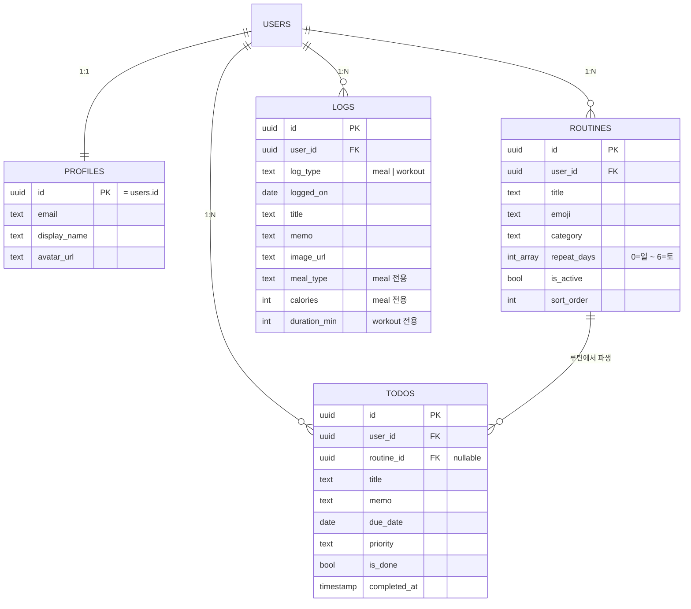

# Wellnest 데이터 모델 명세

> 이 문서는 Wellnest가 다루는 데이터를 **특정 DB 제품에 종속되지 않는 논리 스키마**로 기술한다.
> 현재 구현체(PostgreSQL)의 실제 DDL은 [`supabase/migrations/`](../supabase/migrations)에 있고,
> 이 문서는 그 DDL의 "의미"를 옮겨 적은 것이다. 둘은 항상 일치해야 한다.

---

## 1. 개요



**엔티티 4개**

| 엔티티 | 역할 | 수명 |
|---|---|---|
| `profiles` | 사용자 표시 정보(닉네임·아바타). 계정 테이블과 1:1 | 계정과 함께 생성/삭제 |
| `routines` | 반복 규칙. "무엇을 매주 어떤 요일에 할지" | 사용자가 만들고 지움 |
| `todos` | 특정 날짜의 실행 단위. 루틴에서 파생되거나 직접 생성 | 날짜별로 쌓임 |
| `logs` | 식단·운동 기록. 사진 첨부 가능 | 날짜별로 쌓임 |

### 설계 판단 두 가지

**1) 식단과 운동을 한 테이블(`logs`)로 합쳤다.**
두 기록은 *언제 / 무엇을 / 사진 / 메모* 라는 골격이 동일하고 타입별 필드만 다르다. 합쳐두면
오늘 화면에서 단일 타임라인으로 그릴 수 있고, '수면'·'수분' 같은 타입을 테이블 추가 없이
늘릴 수 있다. 타입별 필드 정합성은 `CHECK` 제약으로 강제한다.

**2) 루틴과 할 일을 분리하고 `routine_id`로 연결했다.**
루틴은 "규칙", 할 일은 "그 날의 실행"이다. 루틴을 지워도 이미 만들어진 할 일 기록은
남아야 하므로 `routine_id`는 `NULL` 허용 + 부모 삭제 시 `NULL`로 끊는다.

---

## 2. 테이블 명세

논리 타입은 다음 약어를 쓴다.
`UUID` · `TEXT` · `INT` · `SMALLINT` · `BOOL` · `DATE` · `TIMESTAMPTZ`(타임존 포함 시각) · `SMALLINT[]`(정수 배열)

### 2.1 `profiles`

| 컬럼 | 타입 | NULL | 기본값 | 설명 |
|---|---|:---:|---|---|
| `id` | UUID | ✗ | — | PK. 계정 테이블의 사용자 id와 동일 |
| `email` | TEXT | ✓ | — | 로그인 이메일 사본 (표시용) |
| `display_name` | TEXT | ✓ | `NULL` | 닉네임. 최초에는 OAuth 프로필 이름 |
| `avatar_url` | TEXT | ✓ | `NULL` | 업로드한 프로필 사진 URL. `NULL`이면 앱 기본 이미지 |
| `created_at` | TIMESTAMPTZ | ✗ | now | |
| `updated_at` | TIMESTAMPTZ | ✗ | now | 갱신 시 자동 변경 |

- **FK**: `id` → 계정 테이블 `id`, 계정 삭제 시 `CASCADE`
- **규칙**: `avatar_url`은 *우리 스토리지에 업로드된 사진* 하나만을 출처로 삼는다.
  OAuth 제공자의 사진을 복사해 넣지 않는다 (출처가 둘로 갈리면 "사진 삭제"의 의미가 모호해진다).
- **규칙**: `display_name`을 읽지 못한 경우 이메일 앞부분 등으로 임시 값을 채우지 않고 `NULL`로 둔다.
  "아직 모르는 상태"와 "사용자가 정한 값"을 구분할 수 있어야 나중에 보정이 가능하다.

### 2.2 `routines`

| 컬럼 | 타입 | NULL | 기본값 | 설명 |
|---|---|:---:|---|---|
| `id` | UUID | ✗ | 생성 | PK |
| `user_id` | UUID | ✗ | — | 소유자 |
| `title` | TEXT | ✗ | — | 루틴 이름 |
| `emoji` | TEXT | ✓ | `NULL` | 목록에 표시할 이모지 |
| `category` | TEXT | ✗ | `'life'` | 분류 |
| `repeat_days` | SMALLINT[] | ✗ | `{}` | 반복 요일. `0`=일 ~ `6`=토, **빈 배열이면 매일** |
| `is_active` | BOOL | ✗ | `true` | 끄면 오늘 화면에 노출되지 않음 |
| `sort_order` | INT | ✗ | `0` | 목록 정렬 순서 |
| `created_at` / `updated_at` | TIMESTAMPTZ | ✗ | now | |

- **FK**: `user_id` → 계정, `CASCADE`
- **제약**: `title` 길이 1–60
- **제약**: `category` ∈ { `health`, `meal`, `mind`, `life` }
- **인덱스**: (`user_id`, `sort_order`)

### 2.3 `todos`

| 컬럼 | 타입 | NULL | 기본값 | 설명 |
|---|---|:---:|---|---|
| `id` | UUID | ✗ | 생성 | PK |
| `user_id` | UUID | ✗ | — | 소유자 |
| `routine_id` | UUID | ✓ | `NULL` | 파생된 루틴. 직접 만든 할 일은 `NULL` |
| `title` | TEXT | ✗ | — | 할 일 |
| `memo` | TEXT | ✓ | `NULL` | |
| `due_date` | DATE | ✗ | 오늘 | 어느 날짜의 할 일인지 |
| `priority` | TEXT | ✗ | `'normal'` | 우선순위 |
| `is_done` | BOOL | ✗ | `false` | 완료 여부 |
| `completed_at` | TIMESTAMPTZ | ✓ | `NULL` | 완료 시각 |
| `created_at` / `updated_at` | TIMESTAMPTZ | ✗ | now | |

- **FK**: `user_id` → 계정, `CASCADE` / `routine_id` → `routines.id`, **`SET NULL`**
- **제약**: `title` 길이 1–120
- **제약**: `priority` ∈ { `low`, `normal`, `high` }
- **인덱스**: (`user_id`, `due_date` DESC)
- **유니크**: (`user_id`, `routine_id`, `due_date`) — `routine_id`가 `NULL`이 아닌 행에만 적용.
  같은 루틴이 같은 날 두 번 생성되는 것을 DB 레벨에서 막는다.

### 2.4 `logs`

| 컬럼 | 타입 | NULL | 기본값 | 설명 |
|---|---|:---:|---|---|
| `id` | UUID | ✗ | 생성 | PK |
| `user_id` | UUID | ✗ | — | 소유자 |
| `log_type` | TEXT | ✗ | — | `meal` 또는 `workout` |
| `logged_on` | DATE | ✗ | 오늘 | 기록 날짜 |
| `title` | TEXT | ✗ | — | 먹은 것 / 한 운동 |
| `memo` | TEXT | ✓ | `NULL` | |
| `image_url` | TEXT | ✓ | `NULL` | 첨부 사진 URL |
| `meal_type` | TEXT | ✓ | `NULL` | **`meal` 전용** — 아침/점심/저녁/간식 |
| `calories` | INT | ✓ | `NULL` | **`meal` 전용** — kcal |
| `duration_min` | INT | ✓ | `NULL` | **`workout` 전용** — 분 |
| `created_at` / `updated_at` | TIMESTAMPTZ | ✗ | now | |

- **FK**: `user_id` → 계정, `CASCADE`
- **제약**: `title` 길이 1–120
- **제약**: `log_type` ∈ { `meal`, `workout` }
- **제약**: `meal_type` ∈ { `breakfast`, `lunch`, `dinner`, `snack` }
- **제약**: `calories >= 0`, `duration_min >= 0`
- **제약(핵심)**: 타입별 필드 정합성
  ```
  (log_type = 'meal'    AND duration_min IS NULL)
  OR
  (log_type = 'workout' AND meal_type IS NULL AND calories IS NULL)
  ```
- **인덱스**: (`user_id`, `logged_on` DESC)

---

## 3. 자동 동작 (트리거)

| 대상 | 시점 | 동작 |
|---|---|---|
| 4개 테이블 전부 | UPDATE 전 | `updated_at`을 현재 시각으로 갱신 |
| 계정 테이블 | INSERT 후 | 같은 `id`로 `profiles` 행 생성 (`display_name`은 OAuth 이름, `avatar_url`은 `NULL`) |

두 동작 모두 "DB가 보장하는 불변식"이다. 애플리케이션 코드가 빠뜨려도 깨지지 않아야 한다.
트리거를 지원하지 않는 환경으로 옮긴다면 저장 계층(`src/features/*/actions.ts`)에서 동일 규칙을 수행한다.

---

## 4. 접근 제어 규칙

모든 접근은 아래 한 문장으로 요약된다.

> **어떤 행이든 `user_id`(또는 `profiles.id`)가 현재 로그인 사용자와 같을 때만 읽고 쓸 수 있다.**

현재 구현은 이 규칙을 **두 겹**으로 건다.

| 계층 | 방식 |
|---|---|
| 애플리케이션 | 서버에서 검증한 사용자 id를 모든 쿼리 조건에 주입한다. 클라이언트가 보낸 `user_id`는 신뢰하지 않는다 (`src/lib/auth.ts`의 `requireUser()`) |
| 데이터베이스 | 행 수준 보안 정책으로 동일 조건을 강제한다 |

DB 쪽 정책이 없는 엔진으로 옮기더라도 애플리케이션 계층이 이미 같은 조건을 걸고 있으므로
접근 제어 자체는 유지된다. 다만 **방어선이 한 겹 줄어든다**는 점은 기록해 둔다.

---

## 5. 이미지 저장 규칙

이미지 바이너리는 DB가 아니라 오브젝트 스토리지에 두고, 테이블에는 URL만 남긴다.

| 버킷 | 용도 | 경로 규칙 |
|---|---|---|
| `avatars` | 프로필 사진 | `{user_id}/avatar-{timestamp}.{ext}` |
| `log-images` | 기록 사진 | `{user_id}/{timestamp}-{random}.{ext}` |

- **경로 첫 폴더가 곧 소유자**다. 쓰기·수정·삭제는 그 폴더가 본인 id일 때만 허용한다.
- 업로드 제한: 5MB 이하, `image/jpeg` · `png` · `webp` · `heic`.
  같은 검증을 앱(`src/lib/storage.ts`)과 스토리지 양쪽에 건다. 앱 검증만으로는 우회가 가능하기 때문이다.
- 업로드는 성공했는데 DB 저장이 실패하면 방금 올린 파일을 되돌린다 (고아 파일 방지, `src/lib/storage.server.ts`).

---

## 6. 이식성 메모

다른 관계형 엔진으로 이 스키마를 옮길 때 **논리적으로는 그대로 성립하지만 표현 방식이 달라지는** 지점만 정리한다.
나머지(PK/FK, `CHECK`, 일반 인덱스, `DATE`/`BOOL`/문자열)는 표준 범위 안에 있다.

| 항목 | 현재 표현 | 엔진이 지원하지 않을 때의 대안 |
|---|---|---|
| `repeat_days` 배열 | `SMALLINT[]` | ① 7비트 정수 비트마스크(`0b0111110` = 주중) ② `routine_repeat_days(routine_id, day)` 연결 테이블 |
| 부분 유니크 인덱스 | `UNIQUE ... WHERE routine_id IS NOT NULL` | `routine_id`의 NULL 대신 고정 센티넬 값(예: 영(zero) UUID)을 쓰고 일반 유니크 인덱스를 건다 |
| UUID 기본값 | DB 함수로 생성 | 애플리케이션에서 UUID를 만들어 INSERT에 포함한다 |
| 타임존 포함 시각 | `TIMESTAMPTZ` | UTC로 저장하는 시각 타입 + "저장은 항상 UTC" 규칙. **표시·집계는 `Asia/Seoul` 기준**이라는 앱 규칙은 그대로 유지 (`src/lib/date.ts`) |
| 문자열 길이 제약 | `CHECK (char_length(x) BETWEEN a AND b)` | 동등한 `CHECK` 또는 `VARCHAR(n)` |
| 행 수준 보안 | DB 정책 | 4절 참고 — 애플리케이션 계층 조건이 이미 동일 규칙을 강제한다 |
| 계정 테이블 참조 | 인증 스키마의 `users` 참조 | 자체 `users` 테이블을 두고 `profiles.id`가 이를 참조 |

> 데이터 접근 코드는 전부 `src/features/*/actions.ts`와 `src/lib/`에 모여 있고 화면 컴포넌트는
> 이 함수들만 호출한다. 저장 계층을 교체할 때 손대야 하는 범위를 이 경계 안으로 묶어 둔 것이다.
